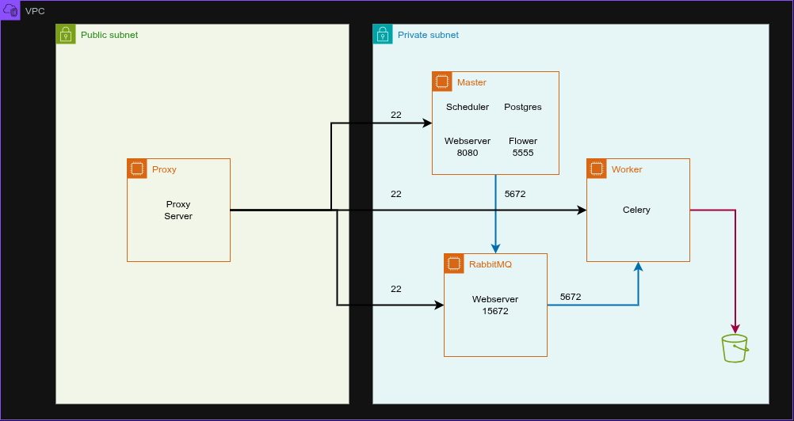

# Nebula Infrastructure

## Context
We developed this activity with our TL [Janner](https://gist.github.com/Janner-GP), with the aim of designing and 
implementing a robust, scalable and secure data infrastructure on AWS. The goal is to master an enterprise-level architecture and to understand the flow and the responsibility of each component.

---

## Diagram

---

## Network Segmentation
*   **Public Subnet:** Hosts the **Proxy/Bastion Host** (Nginx), acting as the gatekeeper for administrative access and external traffic.
*   **Private Subnet:** Contains the **Master Node** (Scheduler/Webserver), **RabbitMQ** (Message Broker), and **3 Worker Nodes**.
*   **NAT Gateway:** Enables nodes in the private subnet to securely reach the internet for dependency updates and log persistence to **Amazon S3**.

---

## Network security (Security Group)

Based on our implementation, we follow the **Principle of Least Privilege**.

### 1. Proxy / Bastion (Public)
| Type       | Port   | Source    | Description                   |
|:-----------|:-------|:----------|:------------------------------|
| SSH        | 22     | 0.0.0.0/0 | Remote administration         |
| HTTP/HTTPS | 80/443 | 0.0.0.0/0 | Public access to web services |
| Custom TCP | 81     | 0.0.0.0/0 | Admin panel access            |

### 2. Master Node (Private)
| Type       | Port    | Source      | Description                   |
|:-----------|:--------|:------------|:------------------------------|
| SSH        | 22      | SG-PROXY    | Access only via Proxy         |
| PostgreSQL | 5432    | 27.0.2.0/24 | DB access from private subnet |
| Custom TCP | 8080    | 0.0.0.0/0   | Temporal Airflow UI access    |
| All TCP    | 0-65535 | SG-WORKERS  | Internal communication        |

### 3. RabbitMQ Broker (Private)
| Type       | Port  | Source      | Description                         |
|:-----------|:------|:------------|:------------------------------------|
| SSH        | 22    | 27.0.1.0/24 | Management subnet access            |
| Custom TCP | 5672  | 27.0.2.0/24 | Messaging protocol (Master/Workers) |
| Custom TCP | 15672 | 27.0.2.0/24 | RabbitMQ Management UI              |

### 4. Worker Nodes (Private)
| Type    | Port    | Source    | Description                    |
|:--------|:--------|:----------|:-------------------------------|
| SSH     | 22      | SG-PROXY  | Access only via Proxy          |
| All TCP | 0-65535 | SG-MASTER | Control signals from Scheduler |
| All TCP | 0-65535 | SG-RABBIT | Task fetching from Broker      |

---

## Components
*   **Orchestrator:** Apache Airflow 2.10.5
*   **Executor:** Celery Executor
*   **Broker:** RabbitMQ (AMQP Protocol)
*   **Database:** PostgreSQL 13
*   **Monitoring:** Flower (Real-time Celery monitoring)
*   **Cloud Services:** AWS (EC2, S3, VPC, NAT Gateway)
*   **Containerization:** Docker & Docker Compose (YAML Anchors for DRY configuration)

---

## Deployment
### Prerequisites
- AWS Account
- Docker & Docker Compose installed
- Python 3.x

### Steps
1. Clone the repository
2. Configure your AWS credentials
3. Deploy each component following the order: Proxy → Master → RabbitMQ → Workers

---

## Work Team

- Paula Rodríguez
- Sebastian Mejia
- Andres Guerra
- Héctor Ríos