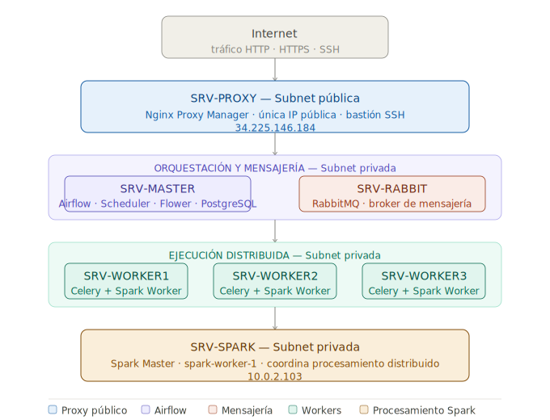

# DOC 1 — Contexto General del Proyecto NEBULA
 
> **Modalidad:** Ruta avanzada - Análisis de datos  
> **Plataforma cloud:** AWS (us-east-1 — N. Virginia)  
> **Dominio:** coderhivex.com  
> **Repositorio:** [Nebula-Infra](https://github.com/HecRodCode/Nebula-Infra)

---

## Tabla de Contenidos

1. [¿Qué es NEBULA?](#1-qué-es-nebula)
2. [Visión general de la arquitectura](#2-visión-general-de-la-arquitectura)
3. [Glosario conceptual](#3-glosario-conceptual)
   - [Infraestructura y red](#31-infraestructura-y-red)
   - [Herramientas y servicios](#32-herramientas-y-servicios)
   - [Git y control de versiones](#33-git-y-control-de-versiones)
4. [El repositorio GitHub](#4-el-repositorio-github)
5. [Convenciones y reglas del equipo](#5-convenciones-y-reglas-del-equipo)

---

## 1. ¿Qué es NEBULA?

**NEBULA** es el nombre del proyecto que desarrollamos como parte de un entrenamiento intensivo de análisis de datos. El objetivo es construir, desde cero, una plataforma real de ingeniería de datos desplegada en la nube (AWS), que sea capaz de:

- **Orquestar pipelines de datos** — definir, programar y ejecutar flujos de trabajo de procesamiento de datos de forma automatizada.
- **Procesar grandes volúmenes de datos** — distribuir el procesamiento entre múltiples servidores para hacerlo más rápido y eficiente.
- **Ejecutar tareas de forma distribuida** — repartir el trabajo entre varios nodos (servidores) que trabajan en paralelo.
- **Exponer servicios de forma segura** — publicar interfaces de monitoreo y administración accesibles desde internet, pero protegidas correctamente.

El proyecto no es solo un ejercicio teórico: toda la infraestructura está desplegada y funcionando en servidores reales en AWS, con herramientas del mundo profesional de la ingeniería de datos.

---

## 2. Visión General de la Arquitectura

Antes de entrar en los detalles técnicos, es importante entender la imagen completa: **qué piezas existen, cómo se conectan y por qué están organizadas así**.

### La idea central

El sistema está dividido en **capas**:

1. **Capa de acceso público** — Un único servidor (el Proxy) es el que está expuesto a internet. Nadie puede llegar directamente a los servidores internos desde afuera. Todo pasa por el Proxy.

2. **Capa de orquestación** — Un servidor Master controla y coordina todo el trabajo: programa las tareas, decide cuándo y cómo ejecutarlas, y almacena el historial.

3. **Capa de mensajería** — Un servidor RabbitMQ actúa como cartero: recibe los encargos de trabajo del Master y los reparte entre los Workers disponibles.

4. **Capa de ejecución** — Tres servidores Worker tienen un **doble rol**: como **Celery Workers** reciben tareas de Airflow (a través de RabbitMQ) y las ejecutan; y como **Spark Workers** participan en el procesamiento distribuido de datos coordinado por SRV-SPARK. Cada servidor divide sus recursos entre ambos procesos.

5. **Capa de procesamiento masivo** — Un servidor Spark (SRV-SPARK) actúa como **Spark Master**: coordina y distribuye el trabajo entre sus Workers. El clúster Spark está compuesto por 4 Workers en total: uno local en SRV-SPARK y uno en cada SRV-WORKER1/2/3.



---

## 3. Glosario Conceptual

Esta sección explica cada concepto que aparece en el proyecto: qué es, cómo funciona en términos simples y cuál es su rol específico dentro de NEBULA.

---

### 3.1 Infraestructura y Red

---

#### AWS — Amazon Web Services

**¿Qué es?**
AWS es una plataforma de servicios en la nube de Amazon. En lugar de comprar servidores físicos, los "alquilamos" virtualmente y solo pagamos por lo que usamos. Ofrece cientos de servicios: servidores virtuales, almacenamiento, bases de datos, redes, seguridad, etc.

**En NEBULA:**
Toda la infraestructura del proyecto vive en AWS. Usamos principalmente cuatro de sus servicios: VPC (red privada), EC2 (servidores), IAM (control de acceso) y S3 (almacenamiento de logs).

---

#### VPC — Virtual Private Cloud

**¿Qué es?**
Una VPC es una red privada virtual dentro de AWS. Piénsala como el edificio donde viven todos nuestros servidores: tiene sus propias reglas de acceso, sus propios pasillos (subredes) y sus propias puertas de entrada y salida.

**¿Por qué existe?**
Sin una VPC, todos los recursos de AWS estarían expuestos en una red compartida con otros clientes. La VPC nos da **aislamiento y control total** sobre la red donde vive nuestro clúster.

**En NEBULA:**
Tenemos una VPC llamada **VPC-NEBULA** con el bloque de IPs `10.0.0.0/16`. Todos nuestros servidores (EC2) viven dentro de esta VPC.

---

#### CIDR — Notación de Rangos de IP

**¿Qué es?**
CIDR es la forma en que se expresan rangos de direcciones IP. Por ejemplo, `10.0.0.0/16` significa: *"todas las IPs que empiecen con `10.0.` y luego cualquier número"*, lo que da un total de 65.536 IPs posibles.

**¿Cómo leerlo?**
El número después de la `/` indica cuántos bits están "fijos". Mientras más grande el número, menos IPs incluye el rango:
- `/16` → ~65.000 IPs (toda la VPC)
- `/24` → ~256 IPs (una subnet)

**En NEBULA:**
- La VPC usa `10.0.0.0/16`
- La subnet pública usa `10.0.1.0/24`
- La subnet privada usa `10.0.2.0/24`

---

#### Subnets — Subredes

**¿Qué son?**
Son divisiones lógicas dentro de la VPC. Si la VPC es el edificio, las subnets son los pisos. Cada subnet tiene su propio rango de IPs y sus propias reglas de acceso a internet.

**Tipos:**
- **Subnet pública:** los recursos aquí pueden tener IP pública y comunicarse directamente con internet.
- **Subnet privada:** los recursos aquí **no** son accesibles directamente desde internet. Solo pueden recibir tráfico desde dentro de la misma red.

**En NEBULA:**

| Subnet | Tipo | CIDR | Qué vive aquí |
|---|---|---|---|
| SUBNET-NEBULA-PUBLIC | Pública | `10.0.1.0/24` | SRV-PROXY |
| SUBNET-NEBULA-PRIVATE | Privada | `10.0.2.0/24` | SRV-MASTER, SRV-RABBIT, SRV-SPARK, SRV-WORKER1/2/3 |

---

#### Internet Gateway (IGW)

**¿Qué es?**
Es la puerta de entrada/salida entre la VPC y el internet público. Sin él, ningún recurso dentro de la VPC puede comunicarse con el mundo exterior.

**En NEBULA:**
Existe un Internet Gateway llamado **IGW-NEBULA**, asociado a la subnet pública. Gracias a él, SRV-PROXY puede recibir tráfico de internet y los usuarios pueden acceder a las interfaces web del sistema.

---

#### NAT Gateway

**¿Qué es?**
NAT Gateway permite que los servidores en la subnet **privada** puedan salir a internet (para descargar actualizaciones, paquetes, etc.), pero **sin que internet pueda entrar hacia ellos**. Es una comunicación de una sola vía: de adentro hacia afuera, nunca de afuera hacia adentro.

**Analogía:** es como una puerta giratoria que solo deja salir, nunca entrar.

**En NEBULA:**
El **NATGW-NEBULA** está ubicado en la subnet pública y tiene su propia IP pública (`3.94.237.145`). Todos los servidores privados usan esta IP cuando necesitan conectarse a internet.

---

#### Route Tables — Tablas de Enrutamiento

**¿Qué son?**
Son las reglas que le dicen al tráfico de red hacia dónde ir. Cada subnet tiene su propia tabla de enrutamiento.

**En NEBULA:**

| Tabla | Subnet | Regla para tráfico externo |
|---|---|---|
| RT-PUBLIC | Subnet pública | Va directo al Internet Gateway |
| RT-PRIVATE | Subnet privada | Va al NAT Gateway (salida) |

---

#### Security Groups — Grupos de Seguridad

**¿Qué son?**
Son firewalls virtuales que se asignan a cada servidor individualmente. Controlan qué tráfico puede entrar (**inbound**) y salir (**outbound**) de cada instancia EC2. Solo el tráfico que cumple alguna regla del Security Group es permitido; todo lo demás se bloquea automáticamente.

**En NEBULA:**
Cada servidor tiene su propio Security Group, ajustado exactamente a lo que ese servidor necesita. Esto implementa el principio de **mínimo privilegio**: cada servidor solo acepta el tráfico estrictamente necesario para hacer su trabajo.

| Security Group | Servidor | Rol |
|---|---|---|
| SG-PROXY | SRV-PROXY | Acepta tráfico de internet (HTTP/HTTPS/SSH) |
| SG-MASTER | SRV-MASTER | Solo acepta tráfico desde el Proxy y la subnet privada |
| SG-RABBIT | SRV-RABBIT | Solo acepta tráfico de mensajería desde la subnet privada |
| SG-WORKERS | SRV-WORKER1/2/3 | Solo acepta tráfico desde Master y RabbitMQ |
| SG-SPARK | SRV-SPARK | Solo acepta tráfico de Spark desde Master y Workers |

---

#### EC2 — Elastic Compute Cloud

**¿Qué es?**
EC2 es el servicio de AWS que provee servidores virtuales (llamados "instancias"). Podemos elegir la cantidad de CPU, RAM, y el sistema operativo que queremos. En este proyecto todas las instancias corren **Ubuntu 24.04**.

**En NEBULA:**
Tenemos 7 instancias EC2, cada una con un rol específico. Son como 7 computadoras independientes que se comunican entre sí a través de la red privada de la VPC.

---

#### Elastic IP

**¿Qué es?**
Una IP pública estática que reservamos en AWS y asociamos a un recurso. A diferencia de las IPs públicas normales (que cambian cada vez que se reinicia una instancia), una Elastic IP siempre es la misma.

**En NEBULA:**
Tenemos 2 Elastic IPs:
- Una asociada a **SRV-PROXY** (`34.225.146.184`) — es la dirección pública fija del sistema.
- Una asociada al **NAT Gateway** (`3.94.237.145`) — es la IP con la que los servidores privados salen a internet.

---

#### IAM — Identity and Access Management

**¿Qué es?**
IAM es el servicio de AWS para gestionar quién puede hacer qué dentro de la cuenta. Permite crear usuarios, roles y permisos. Por ejemplo, si queremos que nuestros servidores puedan escribir en S3, les asignamos un rol IAM con ese permiso.

**En NEBULA:**
Se usan credenciales IAM (`AWS_ACCESS_KEY_ID` y `AWS_SECRET_ACCESS_KEY`) para que Airflow pueda guardar logs en S3 de forma automatizada.

---

#### S3 — Simple Storage Service

**¿Qué es?**
S3 es el servicio de almacenamiento de objetos de AWS. Funciona como una carpeta gigante en la nube donde podemos guardar cualquier tipo de archivo (logs, datos, backups, imágenes, etc.) con alta disponibilidad y bajo costo.

**En NEBULA:**
Se usa un bucket S3 llamado `nebula2-airflow-logs` para almacenar los logs de ejecución de Airflow de forma remota. Esto permite que los logs persistan aunque los contenedores se reinicien.

---

#### Key Pair (.pem)

**¿Qué es?**
Un par de claves criptográficas que AWS genera para autenticar el acceso SSH a las instancias EC2. AWS guarda la clave pública en el servidor y nosotros guardamos la clave privada (archivo `.pem`). Es la forma segura de conectarse a los servidores sin usar contraseñas.

**¡Importante!** El archivo `.pem` es como la llave de tu casa: si la pierdes no puedes entrar, y si alguien más la tiene puede entrar. Nunca debe subirse a GitHub.

**En NEBULA:**
Tenemos 5 key pairs, uno por cada rol de servidor:

| Key Pair | Servidor |
|---|---|
| `KEY-PROXY.pem` | SRV-PROXY |
| `KEY-MASTER-NEBULA-2.pem` | SRV-MASTER |
| `KEY-RABBIT.pem` | SRV-RABBIT |
| `KEY-WORKERS.pem` | SRV-WORKER1, SRV-WORKER2, SRV-WORKER3 |
| `KEY-SPARK.pem` | SRV-SPARK |

---

#### Bastion Host / ProxyJump

**¿Qué es?**
Un Bastion Host (o "servidor bastión") es un servidor que actúa como único punto de entrada SSH a una red privada. En lugar de exponer todos los servidores a internet, solo exponemos uno (el bastión) y desde allí saltamos a los demás.

**ProxyJump** es la configuración SSH que permite "saltar" a través de un servidor intermedio para llegar al destino final.

**Analogía:** Es como la recepción de un edificio corporativo. Para llegar a cualquier oficina interna, primero debes pasar por recepción.

**En NEBULA:**
**SRV-PROXY** actúa como bastión. Para conectarse por SSH a cualquier servidor privado (Master, Rabbit, Workers, Spark), primero se establece conexión con SRV-PROXY y desde allí se salta al servidor destino. Esto se configura con la directiva `ProxyJump` en `~/.ssh/config`.

---

### 3.2 Herramientas y Servicios

---

#### Docker

**¿Qué es?**
Docker es una herramienta que permite empaquetar una aplicación junto con todas sus dependencias en un "contenedor". Un contenedor es como una caja sellada que contiene todo lo necesario para que la aplicación funcione, independientemente del sistema donde se ejecute.

**Analogía:** Si una aplicación fuera una receta de cocina, Docker sería la caja de comida preparada: ya viene con todos los ingredientes medidos y listos, sin importar si la cocinas en tu casa o en un restaurante.

**En NEBULA:**
Cada servicio del proyecto corre dentro de un contenedor Docker. Esto garantiza que el ambiente de ejecución sea siempre el mismo, sin importar qué servidor lo corra.

---

#### Docker Compose

**¿Qué es?**
Docker Compose es una herramienta que permite definir y levantar múltiples contenedores Docker al mismo tiempo, usando un único archivo de configuración llamado `docker-compose.yml`.

**En NEBULA:**
Cada instancia EC2 tiene su propio `docker-compose.yml` dentro del repositorio, en su carpeta correspondiente. Por ejemplo, SRV-MASTER levanta los contenedores de Airflow Webserver, Scheduler, Triggerer, Flower y PostgreSQL con un solo comando: `docker compose up -d`.

---

#### Apache Airflow

**¿Qué es?**
Airflow es una plataforma de orquestación de workflows (flujos de trabajo). Permite definir, programar y monitorear pipelines de datos mediante código Python. Tiene una interfaz web donde se puede ver el estado de cada pipeline, sus ejecuciones históricas y los logs de cada tarea.

**Conceptos clave de Airflow:**

- **DAG** *(Directed Acyclic Graph)*: Es la definición de un pipeline. Especifica qué tareas ejecutar, en qué orden y cuándo. Se escribe en Python y se guarda como un archivo `.py`.
- **Task**: Cada paso individual dentro de un DAG. Por ejemplo: "descargar datos", "transformar datos", "guardar en base de datos".
- **Scheduler**: Componente de Airflow que monitorea constantemente los DAGs y decide cuándo disparar cada tarea según su configuración.
- **Webserver**: La interfaz web de Airflow, accesible en el puerto `8080`.

**En NEBULA:**
Airflow corre en **SRV-MASTER** y usa el modo **CeleryExecutor**, lo que significa que en lugar de ejecutar las tareas localmente, las envía a una cola de mensajes (RabbitMQ) para que sean procesadas por los Workers.

**URL de acceso:** `http://nebula-airflow.coderhivex.com`

---

#### Scheduler (de Airflow)

**¿Qué es?**
El Scheduler es el componente de Airflow que "observa el reloj". Está corriendo constantemente en segundo plano, revisando qué DAGs tienen tareas listas para ejecutarse según su programación, y enviándolas a la cola de ejecución.

**En NEBULA:**
Corre dentro de SRV-MASTER como uno de los contenedores del `docker-compose.yml`. Sin el Scheduler, los DAGs nunca se dispararían automáticamente.

---

#### Celery Executor

**¿Qué es?**
Es el modo de ejecución de Airflow que permite distribuir las tareas entre múltiples Workers. En lugar de ejecutar todo en el servidor de Airflow, las tareas se envían a una cola de mensajes y los Workers las consumen y ejecutan de forma independiente.

**El flujo completo:**

```
Airflow Scheduler
       │ (detecta tarea lista)
       ▼
  RabbitMQ (broker)
       │ (guarda la tarea en cola)
       ▼
  Celery Worker
       │ (toma la tarea y la ejecuta)
       ▼
  PostgreSQL (result backend)
       │ (guarda el resultado)
       ▼
  Airflow (actualiza el estado)
```

**En NEBULA:**
Airflow está configurado con `AIRFLOW__CORE__EXECUTOR=CeleryExecutor`. RabbitMQ es el broker y PostgreSQL es el result backend.

---

#### Broker vs Result Backend

Estos son dos conceptos del sistema Celery que vale la pena distinguir:

| Concepto | ¿Qué hace? | Tecnología en NEBULA |
|---|---|---|
| **Broker** | Recibe las tareas del Scheduler y las encola para que los Workers las consuman | RabbitMQ |
| **Result Backend** | Guarda el resultado de cada tarea (éxito, fallo, valor retornado) para que Airflow pueda consultarlo | PostgreSQL |

**Analogía:** El broker es el tablero de pedidos en una cocina de restaurante (los pedidos llegan y esperan ser tomados). El result backend es el registro donde el mesero anota que el pedido fue entregado.

---

#### RabbitMQ

**¿Qué es?**
RabbitMQ es un broker de mensajería: un sistema que recibe mensajes (tareas) de un productor (Airflow Scheduler) y los entrega a los consumidores (Celery Workers) de forma ordenada y confiable. Usa el protocolo **AMQP** (puerto `5672`).

Tiene también una interfaz web de administración (puerto `15672`) donde se pueden ver las colas, los mensajes pendientes y los consumidores activos.

**En NEBULA:**
Corre en **SRV-RABBIT**. Airflow le envía tareas, y los tres Workers las consumen desde allí.

**URL de acceso:** `http://nebula-rabbitmq.coderhivex.com`

---

#### Celery

**¿Qué es?**
Celery es un framework de Python para ejecutar tareas asíncronas y distribuidas. Un "Celery Worker" es un proceso que está constantemente escuchando la cola de mensajes (RabbitMQ en este caso) y ejecutando las tareas que llegan.

**En NEBULA:**
Los tres Workers (SRV-WORKER1, SRV-WORKER2, SRV-WORKER3) corren cada uno un proceso `airflow celery worker`. Están configurados para escalar automáticamente entre 1 y 4 procesos según la carga de trabajo. Además, cada uno de estos servidores también corre un **Spark Worker** en paralelo, por lo que tienen un doble rol dentro del clúster: ejecutan tareas de Airflow y participan en el procesamiento de datos con Spark al mismo tiempo.

---

#### Celery Flower

**¿Qué es?**
Flower es la interfaz web de monitoreo para Celery. Permite ver en tiempo real cuántos Workers están activos, qué tareas están ejecutando, cuántas tareas han completado, y el estado general del sistema de colas.

**En NEBULA:**
Corre en **SRV-MASTER** en el puerto `5555`.

**URL de acceso:** `http://nebula-flower.coderhivex.com`

---

#### Apache Spark

**¿Qué es?**
Spark es un motor de procesamiento de datos distribuido. Está diseñado para procesar grandes volúmenes de datos de forma muy rápida, dividiendo el trabajo entre múltiples nodos que procesan en paralelo.

Usa una arquitectura **Master-Worker**:
- **Spark Master:** coordina el trabajo, recibe los "jobs" y los distribuye.
- **Spark Workers:** ejecutan las particiones de datos asignadas por el Master.

**En NEBULA:**
El clúster Spark está compuesto por **1 Master + 4 Workers**:
- El **Spark Master** corre en **SRV-SPARK** (puerto `7077` para API, puerto `8090` para Web UI). Coordina y distribuye el trabajo.
- **spark-worker-1** corre en el mismo **SRV-SPARK**, junto al Master, como primer Worker del clúster.
- **spark-worker** corre también en **SRV-WORKER1, SRV-WORKER2 y SRV-WORKER3**, conviviendo con el proceso Celery Worker en cada servidor. Estos tres Workers usan la mitad de los recursos de su instancia (1 core y 1g de RAM) para dejar espacio al Celery Worker.

---

#### PostgreSQL

**¿Qué es?**
PostgreSQL es un sistema de base de datos relacional de código abierto, muy robusto y ampliamente usado en producción. Guarda datos en tablas con relaciones entre ellas, y usa el lenguaje SQL para consultas.

**En NEBULA:**
Corre como contenedor dentro de **SRV-MASTER** en el puerto `5432`. Cumple dos roles:
1. **Metadata store de Airflow:** guarda toda la información de DAGs, ejecuciones, tareas, usuarios, conexiones, etc.
2. **Result backend de Celery:** guarda los resultados de las tareas ejecutadas por los Workers.

---

#### Nginx

**¿Qué es?**
Nginx es un servidor web y proxy inverso de alto rendimiento. Como proxy inverso, recibe peticiones de los usuarios y las redirige al servicio correcto según el dominio o la ruta.

**En NEBULA:**
Corre en **SRV-PROXY** a través de **Nginx Proxy Manager**, que es una versión con interfaz gráfica de Nginx. Permite gestionar los proxy hosts sin editar archivos de configuración manualmente.

---

#### Reverse Proxy — Proxy Inverso

**¿Qué es?**
Un proxy inverso es un servidor que está "delante" de otros servidores. Recibe todas las peticiones de los clientes y las reenvía al servidor interno correspondiente. Para el cliente (navegador), parece que está hablando directamente con el servicio final, pero en realidad pasa por el proxy.

**Ventajas:**
- Un único punto de entrada público (una sola IP pública).
- Los servidores internos permanecen ocultos.
- Permite usar dominios amigables (`nebula-airflow.coderhivex.com`) en lugar de IPs y puertos.
- Centraliza la gestión de SSL/HTTPS.

**En NEBULA:**

| Dominio | Servicio interno | Puerto |
|---|---|---|
| `nebula-airflow.coderhivex.com` | SRV-MASTER (Airflow) | 8080 |
| `nebula-flower.coderhivex.com` | SRV-MASTER (Flower) | 5555 |
| `nebula-rabbitmq.coderhivex.com` | SRV-RABBIT (RabbitMQ UI) | 15672 |

---

### 3.3 Git y Control de Versiones

---

#### Git y Repositorio

**¿Qué es Git?**
Git es un sistema de control de versiones. Permite rastrear todos los cambios que se hacen en el código a lo largo del tiempo, colaborar entre varios desarrolladores sin pisarse el trabajo, y volver a versiones anteriores si algo sale mal.

**¿Qué es un repositorio?**
Un repositorio (o "repo") es la carpeta del proyecto que Git gestiona. Puede vivir localmente en tu computador y también en una plataforma remota como GitHub.

**¿Por qué se clona en cada instancia EC2?**
Cada servidor EC2 clona el repositorio `Nebula-Infra` para tener acceso a su `docker-compose.yml` y a las carpetas de configuración que necesita. De esta forma, el código es la única fuente de verdad: si algo cambia en el repo, basta con hacer `git pull` en el servidor para tenerlo actualizado.

---

## 4. El Repositorio GitHub

El repositorio **`Nebula-Infra`** es el centro del proyecto. Todo el código de infraestructura, configuraciones de contenedores y pipelines de datos vive aquí.

### Estructura de carpetas

```
Nebula-Infra/
│
├── Master/
│   └── docker-compose.yml       ← Configura Airflow + PostgreSQL en SRV-MASTER
│
├── Proxy-Nginx/
│   └── docker-compose.yml       ← Configura Nginx Proxy Manager en SRV-PROXY
│
├── RabbitMQ/
│   └── docker-compose.yml       ← Configura RabbitMQ en SRV-RABBIT
│
├── Spark/
│   └── docker-compose.yml       ← Configura Spark Master en SRV-SPARK
│
├── Workers/
│   └── docker-compose.yml       ← Configura Celery Workers en SRV-WORKER1/2/3
│
├── assets/
│   └── nebula_infra.drawio.png  ← Diagrama de infraestructura
│
├── pipelines/
│   └── dag/
│       └── dag_example.py       ← DAGs de Airflow
│
├── .gitignore                   ← Archivos ignorados por Git (incluye .env)
└── README.md                    ← Descripción general del repositorio
```

### ¿Qué va en cada carpeta?

| Carpeta | Propósito | ¿Quién la usa? |
|---|---|---|
| `Master/` | Configuración de Airflow y PostgreSQL | SRV-MASTER |
| `Proxy-Nginx/` | Configuración del reverse proxy | SRV-PROXY |
| `RabbitMQ/` | Configuración del broker de mensajería | SRV-RABBIT |
| `Spark/` | Configuración del clúster Spark | SRV-SPARK |
| `Workers/` | Configuración de los Celery Workers | SRV-WORKER1, SRV-WORKER2, SRV-WORKER3 |
| `pipelines/dag/` | DAGs de Airflow | SRV-MASTER (los lee el Scheduler) |
| `assets/` | Diagramas e imágenes de documentación | Toda la documentación |

### Variables de entorno (`.env`)

Cada carpeta tiene su propio archivo `.env` que **no está en el repositorio** (está en `.gitignore`). Este archivo contiene las contraseñas, IPs, tokens y demás configuraciones sensibles que cada instancia necesita.

El `.env` se crea directamente en el servidor, nunca se sube a GitHub. Si alguien nuevo del equipo necesita levantar el ambiente, debe recibir los archivos `.env` por un canal seguro.

> ⚠️ **Nunca subas un archivo `.env` al repositorio.** Contiene credenciales que deben mantenerse privadas.

---

## 5. Convenciones y Reglas del Equipo

Estas convenciones aseguran que todos trabajemos de forma ordenada y consistente. Son reglas que todo el equipo debe conocer y respetar.

---

### 5.1 Nomenclatura de recursos AWS

Todos los recursos de AWS siguen el mismo patrón de nombres para que sean fáciles de identificar:

| Tipo de recurso | Prefijo | Ejemplo |
|---|---|---|
| Instancias EC2 | `SRV-` | `SRV-MASTER`, `SRV-PROXY` |
| Security Groups | `SG-` | `SG-MASTER`, `SG-PROXY` |
| Route Tables | `RT-` | `RT-PUBLIC`, `RT-PRIVATE` |
| Subnets | `SUBNET-` | `SUBNET-NEBULA-PUBLIC` |
| Gateways | `IGW-` / `NATGW-` | `IGW-NEBULA`, `NATGW-NEBULA` |
| Key Pairs | `KEY-` | `KEY-PROXY`, `KEY-WORKERS` |

---

### 5.2 Reglas del repositorio

**1. Los archivos `.env` nunca van en Git.**
Son la primera línea en el `.gitignore`. Si por error se agregan, deben removerse inmediatamente y rotar las credenciales expuestas.

**2. Un `docker-compose.yml` por instancia, en su carpeta.**
Cada carpeta del repo corresponde a una instancia (o grupo de instancias para los Workers). No mezclar configuraciones entre carpetas.

**3. Los DAGs van exclusivamente en `pipelines/dag/`.**
Esta carpeta está montada como volumen en el contenedor de Airflow. Agregar DAGs en otro lugar no funcionará.

**4. Convención de nombres para DAGs.**
Los archivos de DAG deben tener nombres descriptivos en minúsculas con guiones bajos:
```
dag_[descripcion_corta].py
Ejemplo: dag_ingesta_ventas.py
```

**5. Documentar cambios importantes en el README.**
Si se agrega un nuevo servicio, se cambia una configuración relevante o se modifica la estructura, actualizar el README del repo.

---

### 5.3 Reglas operativas

**Orden de levantamiento de servicios**

Los servicios tienen dependencias entre sí. Deben levantarse en este orden:

```
1. SRV-PROXY    → Nginx Proxy Manager
2. SRV-RABBIT   → RabbitMQ (debe estar listo antes que los Workers)
3. SRV-MASTER   → PostgreSQL primero (healthcheck), luego Airflow
4. SRV-SPARK    → Spark Master + spark-worker-1 (Worker local en SRV-SPARK)
5. SRV-WORKER1/2/3 → Celery Worker + Spark Worker (2 contenedores por instancia)
```

> ⚠️ **No levantes los Workers antes que RabbitMQ, el Master y Spark.** Los Workers intentarán conectarse al broker, a la base de datos y al Spark Master al iniciar; si alguno no está disponible, el contenedor correspondiente fallará.

> 💡 **`docker compose up -d` en los Workers levanta DOS contenedores simultáneamente:** `airflow-worker` (Celery) y `spark-worker` (Spark). Puedes verificarlo con `docker ps` y verás ambos procesos corriendo.

---

**Antes de hacer `docker compose down`**

Antes de bajar los contenedores en cualquier instancia:
1. Verificar que no haya tareas en ejecución activa en Flower.
2. Avisar al equipo en el canal de comunicación.
3. Si se bajan los Workers, revisar en Flower que las tareas en curso se hayan completado o pausado.

---

**Acceso a Key Pairs**

Cada integrante del equipo debe tener sus propias copias de los archivos `.pem`. Estas claves deben:
- Almacenarse en un lugar seguro (nunca en el Desktop ni en carpetas públicas).
- Tener permisos `chmod 400` (solo lectura para el propietario).
- No compartirse por canales no seguros (no por WhatsApp, email sin encriptar, etc.).

---

*Este documento es parte de la documentación oficial del proyecto NEBULA. Para la infraestructura detallada de AWS, ver **DOC2 — Infraestructura AWS**. Para el flujo operativo y configuraciones, ver **DOC3 — Configuración Operativa y Flujo**.*
