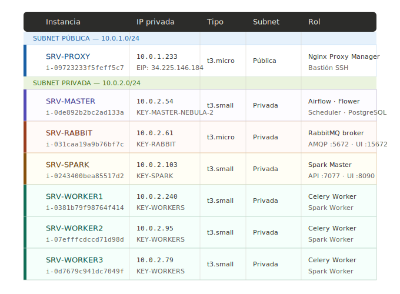
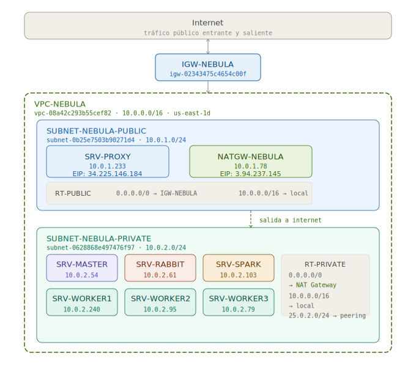
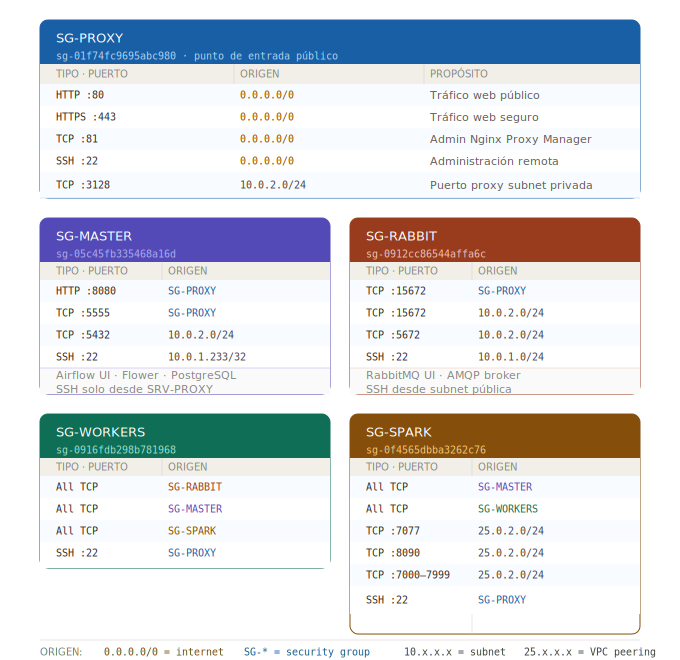
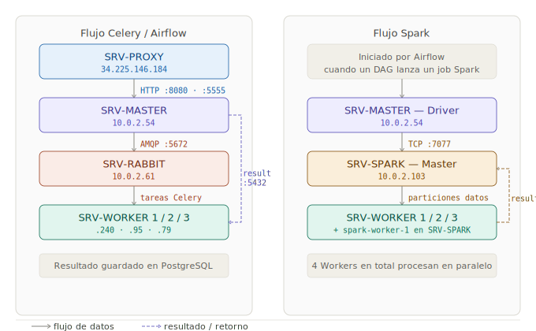

# DOC 2 — Infraestructura AWS

> **Proyecto:** NEBULA  
> **Cuenta AWS:** 805770711079  
> **Región:** us-east-1 (N. Virginia)

---

## Tabla de Contenidos

1. [Resumen del clúster](#1-resumen-del-clúster)
2. [Arquitectura de red](#2-arquitectura-de-red)
   - [VPC](#21-vpc--virtual-private-cloud)
   - [Subnets](#22-subnets--subredes)
   - [Internet Gateway](#23-internet-gateway)
   - [NAT Gateway](#24-nat-gateway)
   - [Elastic IPs](#25-elastic-ips)
   - [Route Tables](#26-route-tables--tablas-de-enrutamiento)
3. [Instancias EC2](#3-instancias-ec2)
4. [Security Groups](#4-security-groups)
5. [Comunicación entre instancias](#5-comunicación-entre-instancias)

---

## 1. Resumen del Clúster

El clúster NEBULA está compuesto por **7 instancias EC2**, todas corriendo **Ubuntu 24.04 LTS**, distribuidas entre una subnet pública y una subnet privada dentro de la misma VPC.

| Instancia | IP Privada | IP Pública | Tipo | Subnet | Rol principal |
|---|---|---|---|---|---|
| SRV-PROXY | `10.0.1.233` | `34.225.146.184` *(Elastic IP)* | t3.micro | PUBLIC | Reverse proxy, bastión SSH |
| SRV-MASTER | `10.0.2.54` | — | t3.small | PRIVATE | Airflow, PostgreSQL, Flower |
| SRV-RABBIT | `10.0.2.61` | — | t3.micro | PRIVATE | RabbitMQ (broker de mensajería) |
| SRV-SPARK | `10.0.2.103` | — | t3.small | PRIVATE | Spark Master |
| SRV-WORKER1 | `10.0.2.240` | — | t3.small | PRIVATE | Celery Worker + Spark Worker |
| SRV-WORKER2 | `10.0.2.95` | — | t3.small | PRIVATE | Celery Worker + Spark Worker |
| SRV-WORKER3 | `10.0.2.79` | — | t3.small | PRIVATE | Celery Worker + Spark Worker |

> **Nota sobre los tipos de instancia:**
> - `t3.micro` (2 vCPU, 1 GB RAM) → servicios de carga ligera (Proxy, RabbitMQ).
> - `t3.small` (2 vCPU, 2 GB RAM) → servicios que requieren más recursos (Airflow, Spark, Workers).
> - En SRV-WORKER1/2/3 los recursos del `t3.small` se dividen entre dos procesos: el **Celery Worker** (1 core, ~1g RAM) y el **Spark Worker** (1 core, 1g RAM).




---

## 2. Arquitectura de Red

Toda la infraestructura de red está organizada dentro de una única VPC. La siguiente imagen muestra la relación entre todos los componentes de red:




---

### 2.1 VPC — Virtual Private Cloud

La VPC es el contenedor principal de toda la infraestructura. Define el espacio de IPs privadas disponibles y el aislamiento de red del proyecto.

| Atributo | Valor |
|---|---|
| **Nombre** | VPC-NEBULA |
| **ID** | `vpc-08a42c293b55cef82` |
| **CIDR** | `10.0.0.0/16` |
| **DNS Resolution** | Habilitado |
| **Estado** | Available |

> El bloque `10.0.0.0/16` permite hasta **65.536 direcciones IP** privadas dentro de la VPC, distribuidas entre todas sus subnets.

---

### 2.2 Subnets — Subredes

La VPC está dividida en dos subnets, ambas en la zona de disponibilidad `us-east-1d`:

#### SUBNET-NEBULA-PUBLIC

| Atributo | Valor |
|---|---|
| **Nombre** | SUBNET-NEBULA-PUBLIC |
| **ID** | `subnet-0b25e7503b90271d4` |
| **CIDR** | `10.0.1.0/24` |
| **IPs disponibles** | 249 |
| **Tipo** | Pública |
| **Route Table asociada** | RT-PUBLIC |
| **Auto-asignación de IP pública** | No (las IPs públicas se asignan manualmente vía Elastic IP) |

**¿Qué vive aquí?**
Solo **SRV-PROXY**. Es el único servidor que necesita ser alcanzable directamente desde internet.

---

#### SUBNET-NEBULA-PRIVATE

| Atributo | Valor |
|---|---|
| **Nombre** | SUBNET-NEBULA-PRIVATE |
| **ID** | `subnet-0628868e497476f97` |
| **CIDR** | `10.0.2.0/24` |
| **IPs disponibles** | 245 |
| **Tipo** | Privada |
| **Route Table asociada** | RT-PRIVATE |
| **Auto-asignación de IP pública** | No |

**¿Qué vive aquí?**
Todos los demás servidores: SRV-MASTER, SRV-RABBIT, SRV-SPARK, SRV-WORKER1, SRV-WORKER2 y SRV-WORKER3. Ninguno tiene IP pública; solo son accesibles desde dentro de la VPC o a través del bastión SSH (SRV-PROXY).

---

### 2.3 Internet Gateway

El Internet Gateway (IGW) es el componente que conecta la VPC con internet. Sin él, ningún tráfico puede entrar o salir de la red.

| Atributo | Valor |
|---|---|
| **Nombre** | IGW-NEBULA |
| **ID** | `igw-02343475c4654c00f` |
| **Estado** | Attached (conectado a VPC-NEBULA) |

**¿Cómo funciona?**
El IGW está referenciado en la tabla de rutas **RT-PUBLIC**. Cuando un paquete proveniente de internet llega a la subnet pública (dirigido a la Elastic IP de SRV-PROXY), el IGW lo traduce y lo entrega. Del mismo modo, cuando SRV-PROXY responde, el IGW traduce la IP privada a la IP pública y envía el paquete de vuelta.

---

### 2.4 NAT Gateway

El NAT Gateway permite que los servidores de la subnet privada inicien conexiones hacia internet (para descargar paquetes, actualizaciones, hacer requests a APIs, etc.) **sin quedar expuestos** a conexiones entrantes desde internet.

| Atributo | Valor |
|---|---|
| **Nombre** | NATGW-NEBULA |
| **ID** | `nat-0bbaaa5989242977e` |
| **Tipo** | Public |
| **IP pública (Elastic IP)** | `3.94.237.145` |
| **IP privada** | `10.0.1.78` |
| **Ubicación** | SUBNET-NEBULA-PUBLIC |
| **Estado** | Available |

**¿Por qué está en la subnet pública?**
El NAT Gateway necesita acceso a internet para hacer su trabajo (redirigir el tráfico saliente). Por eso vive en la subnet pública, donde tiene acceso al Internet Gateway. Los servidores privados le "pasan" su tráfico saliente y él lo envía hacia internet usando su propia IP pública.

**Flujo de salida a internet desde la subnet privada:**
```
SRV-MASTER / SRV-RABBIT / SRV-SPARK / SRV-WORKER (subnet privada)
       │
       ▼ (ruta: 0.0.0.0/0 → NAT Gateway)
  NATGW-NEBULA (10.0.1.78 / IP pública: 3.94.237.145)
       │
       ▼
  Internet Gateway (IGW-NEBULA)
       │
       ▼
  Internet
```

---

### 2.5 Elastic IPs

Una Elastic IP es una dirección IP pública **estática** reservada en AWS. A diferencia de las IPs públicas normales (que cambian cuando se reinicia una instancia), una Elastic IP permanece igual hasta que se libera manualmente.

El proyecto tiene **2 Elastic IPs**:

| Elastic IP | Asociada a | Propósito |
|---|---|---|
| `34.225.146.184` | SRV-PROXY | IP pública fija del sistema; es la dirección a la que apuntan los dominios DNS |
| `3.94.237.145` | NATGW-NEBULA | IP pública del NAT Gateway; es la IP con la que los servidores privados salen a internet |

> **¿Por qué es importante que sean estáticas?**
> Los registros DNS de los dominios (`nebula-airflow.coderhivex.com`, etc.) apuntan a la Elastic IP `34.225.146.184`. Si esta IP cambiara, los dominios dejarían de funcionar hasta actualizar el DNS manualmente.

---

### 2.6 Route Tables — Tablas de Enrutamiento

Las route tables definen a dónde va el tráfico según su destino. Cada subnet está asociada a una tabla diferente.

---

#### RT-PUBLIC (`rtb-071cea84a3bb12f4b`)

Asociada a: **SUBNET-NEBULA-PUBLIC**

| Destino | Target | Descripción |
|---|---|---|
| `10.0.0.0/16` | `local` | Tráfico interno entre recursos de la VPC |
| `0.0.0.0/0` | `igw-02343475c4654c00f` | Todo el tráfico externo va al Internet Gateway |

**Lectura:** Cualquier paquete que no sea para la red interna (`10.0.0.0/16`) sale a internet directamente por el IGW.

---

#### RT-PRIVATE (`rtb-0e58f179111cdeba6`)

Asociada a: **SUBNET-NEBULA-PRIVATE**

| Destino | Target | Descripción |
|---|---|---|
| `10.0.0.0/16` | `local` | Tráfico interno entre recursos de la VPC |
| `0.0.0.0/0` | `nat-0bbaaa5989242977e` | Todo el tráfico externo va al NAT Gateway |
| `25.0.2.0/24` | `pcx-0fc0fd19cfc697c68` | Tráfico hacia VPC externa vía peering |

**Lectura:** Los servidores privados pueden comunicarse entre sí libremente, salir a internet a través del NAT, y también conectarse a una VPC externa mediante la conexión de peering.

> **VPC Peering (`pcx-0fc0fd19cfc697c68`):** Es una conexión privada entre VPC-NEBULA y otra VPC con el rango `25.0.2.0/24`. Esta conexión permite que recursos externos (por ejemplo, un clúster de datos de otra VPC) se comuniquen directamente con SRV-SPARK sin pasar por internet.

---

## 3. Instancias EC2

Todas las instancias corren **Ubuntu 24.04 LTS**. Los detalles de AMI, fecha de lanzamiento y atributos de plataforma son consultables directamente en la consola de AWS.

---

### SRV-PROXY

| Atributo | Valor |
|---|---|
| **Tipo** | t3.micro |
| **IP Privada** | `10.0.1.233` |
| **IP Pública (Elastic IP)** | `34.225.146.184` |
| **Subnet** | SUBNET-NEBULA-PUBLIC |
| **Key Pair** | `KEY-PROXY` |
| **Security Group** | SG-PROXY |

**Rol y responsabilidades:**
- Único servidor accesible directamente desde internet.
- Ejecuta **Nginx Proxy Manager** para enrutar el tráfico HTTP/HTTPS hacia los servicios internos según el dominio.
- Actúa como **bastión SSH**: toda conexión SSH hacia los servidores privados pasa primero por aquí.
- Administración de certificados SSL (Let's Encrypt).

**Servicios que corre (Docker):**
- Nginx Proxy Manager (puertos `80`, `443`, `81`)

---

### SRV-MASTER

| Atributo | Valor |
|---|---|
| **Tipo** | t3.small |
| **IP Privada** | `10.0.2.54` |
| **IP Pública** | — |
| **Subnet** | SUBNET-NEBULA-PRIVATE |
| **Key Pair** | `KEY-MASTER-NEBULA-2` |
| **Security Group** | SG-MASTER |

**Rol y responsabilidades:**
- Corazón del sistema de orquestación.
- Aloja la base de datos PostgreSQL que guarda toda la metadata de Airflow y los resultados de Celery.
- Ejecuta el Scheduler de Airflow que monitorea y dispara los DAGs.
- Expone la interfaz web de Airflow y el monitor Flower.

**Servicios que corre (Docker):**
- PostgreSQL (puerto `5432`)
- Airflow Webserver (puerto `8080`)
- Airflow Scheduler
- Airflow Triggerer
- Airflow Init (solo al iniciar)
- Celery Flower (puerto `5555`)

---

### SRV-RABBIT

| Atributo | Valor |
|---|---|
| **Tipo** | t3.micro |
| **IP Privada** | `10.0.2.61` |
| **IP Pública** | — |
| **Subnet** | SUBNET-NEBULA-PRIVATE |
| **Key Pair** | `KEY-RABBIT` |
| **Security Group** | SG-RABBIT |

**Rol y responsabilidades:**
- Broker de mensajería del sistema.
- Recibe las tareas del Scheduler de Airflow y las coloca en cola.
- Los Workers consumen las tareas desde esta cola.
- Expone interfaz de administración para monitorear colas y consumidores.

**Servicios que corre (Docker):**
- RabbitMQ con management plugin
  - Puerto `5672` — AMQP (protocolo de mensajería)
  - Puerto `15672` — Interfaz de administración web

---

### SRV-SPARK

| Atributo | Valor |
|---|---|
| **Tipo** | t3.small |
| **IP Privada** | `10.0.2.103` |
| **IP Pública** | — |
| **Subnet** | SUBNET-NEBULA-PRIVATE |
| **Key Pair** | `KEY-SPARK` |
| **Security Group** | SG-SPARK |

**Rol y responsabilidades:**
- Nodo master del clúster Apache Spark.
- Recibe los "jobs" de procesamiento de datos y los distribuye entre los Workers.
- Coordina la ejecución paralela de transformaciones sobre grandes volúmenes de datos.

**Servicios que corre (Docker):**
- Spark Master
  - Puerto `7077` — API de Spark (envío de jobs)
  - Puerto `8090` — Spark Master Web UI
- spark-worker-1 (Worker local en el mismo servidor)
  - Puerto `8091` — Spark Worker Web UI
  - Se conecta al Master en `spark://spark-master:7077` (red interna Docker)

---

### SRV-WORKER1, SRV-WORKER2, SRV-WORKER3

Estos tres servidores tienen configuración idéntica y cumplen un **doble rol**: son al mismo tiempo Workers de Celery (para Airflow) y Workers de Spark.

| Atributo | SRV-WORKER1 | SRV-WORKER2 | SRV-WORKER3 |
|---|---|---|---|
| **Tipo** | t3.small | t3.small | t3.small |
| **IP Privada** | `10.0.2.240` | `10.0.2.95` | `10.0.2.79` |
| **Subnet** | PRIVATE | PRIVATE | PRIVATE |
| **Key Pair** | `KEY-WORKERS` | `KEY-WORKERS` | `KEY-WORKERS` |
| **Security Group** | SG-WORKERS | SG-WORKERS | SG-WORKERS |

**Rol y responsabilidades:**
- **Como Celery Workers:** escuchan la cola de RabbitMQ, toman tareas y las ejecutan. Pueden escalar entre 1 y 4 procesos por instancia según la carga (`--autoscale 4,1`).
- **Como Spark Workers:** se registran en el Spark Master (SRV-SPARK) y reciben particiones de datos para procesarlas en paralelo.

**Servicios que corren (Docker):**
- `airflow-worker` — Celery Worker de Airflow
  - Escucha la cola de RabbitMQ (puerto `5672` de SRV-RABBIT)
  - Cada worker tiene un `CELERY_HOSTNAME` único (`worker1`, `worker2`, `worker3`)
- `spark-worker` — Spark Worker
  - Se conecta al Spark Master en `spark://10.0.2.103:7077`
  - Puerto `8091` — Spark Worker Web UI

> ⚠️ **División de recursos en t3.small (2 vCPU / 2 GB RAM):**
>
> | Contenedor | CPU | RAM |
> |---|---|---|
> | `airflow-worker` | ~1 core (autoscale) | ~1 GB |
> | `spark-worker` | 1 core | 1 GB |
>
> Los recursos se dividen explícitamente para que ambos procesos convivan sin afectarse.

---

## 4. Security Groups

Un Security Group funciona como un firewall a nivel de instancia. Solo el tráfico que cumple al menos una de las reglas **inbound** es permitido; todo lo demás se bloquea automáticamente. Las reglas **outbound** por defecto permiten todo el tráfico saliente en todos los Security Groups del proyecto.

> **Principio aplicado:** Mínimo privilegio. Cada servidor solo acepta el tráfico estrictamente necesario para cumplir su función.




---

### SG-PROXY

**ID:** `sg-01f74fc9695abc980`  
**Descripción:** Public proxy entry point  
**Asociado a:** SRV-PROXY

#### Reglas Inbound (5):

| Tipo | Protocolo | Puerto | Origen | ¿Por qué? |
|---|---|---|---|---|
| HTTP | TCP | 80 | `0.0.0.0/0` | Tráfico web desde cualquier lugar de internet |
| HTTPS | TCP | 443 | `0.0.0.0/0` | Tráfico web seguro desde cualquier lugar |
| Custom TCP | TCP | 81 | `0.0.0.0/0` | Interfaz admin de Nginx Proxy Manager |
| SSH | TCP | 22 | `0.0.0.0/0` | Acceso SSH de administración desde internet |
| Custom TCP | TCP | 3128 | `10.0.2.0/24` | Puerto proxy para requests desde la subnet privada |

---

### SG-MASTER

**ID:** `sg-05c45fb335468a16d`  
**Descripción:** Acceso SSH al nodo Master desde internet  
**Asociado a:** SRV-MASTER

#### Reglas Inbound (4):

| Tipo | Protocolo | Puerto | Origen | ¿Por qué? |
|---|---|---|---|---|
| Custom TCP | TCP | 5555 | SG-PROXY | Flower UI — solo accesible vía el proxy |
| PostgreSQL | TCP | 5432 | `10.0.2.0/24` | Workers necesitan conectarse a la BD de Airflow |
| Custom TCP | TCP | 8080 | SG-PROXY | Airflow Webserver — solo accesible vía el proxy |
| SSH | TCP | 22 | `10.0.1.233/32` | SSH solo desde la IP exacta de SRV-PROXY (bastión) |

> **Nota importante:** El puerto `22` solo acepta conexiones desde `10.0.1.233/32`, que es la IP privada exacta de SRV-PROXY. Nadie más puede hacer SSH directamente a SRV-MASTER.

---

### SG-RABBIT

**ID:** `sg-0912cc86544affa6c`  
**Descripción:** Messaging service node  
**Asociado a:** SRV-RABBIT

#### Reglas Inbound (4):

| Tipo | Protocolo | Puerto | Origen | ¿Por qué? |
|---|---|---|---|---|
| Custom TCP | TCP | 15672 | `10.0.2.0/24` | Interfaz web RabbitMQ — accesible desde la subnet privada (el proxy la reenvía al exterior) |
| Custom TCP | TCP | 15672 | SG-PROXY | El proxy necesita alcanzar el puerto de la UI de RabbitMQ para reenviarla al exterior |
| SSH | TCP | 22 | `10.0.1.0/24` | SSH desde cualquier IP de la subnet pública |
| Custom TCP | TCP | 5672 | `10.0.2.0/24` | AMQP — Airflow y Workers se conectan al broker por este puerto |

---

### SG-SPARK

**ID:** `sg-0f4565dbba3262c76`  
**Descripción:** Private EC2 for Spark workloads  
**Asociado a:** SRV-SPARK

#### Reglas Inbound (6):

| Tipo | Protocolo | Puerto | Origen | ¿Por qué? |
|---|---|---|---|---|
| Custom TCP | TCP | 7077 | `25.0.2.0/24` | API de Spark Master — acepta jobs desde la VPC externa (peering) |
| All TCP | TCP | 0–65535 | SG-MASTER | Comunicación total con SRV-MASTER (envío de jobs Spark desde Airflow) |
| Custom TCP | TCP | 8090 | `25.0.2.0/24` | Spark Web UI — accesible desde la VPC externa |
| Custom TCP | TCP | 7000–7999 | `25.0.2.0/24` | Rango de puertos para comunicación interna del clúster Spark |
| SSH | TCP | 22 | SG-PROXY | SSH solo a través del bastión |
| All TCP | TCP | 0–65535 | SG-WORKERS | Comunicación libre con los Workers (necesaria para distribuir trabajo Spark) |

---

### SG-WORKERS

**ID:** `sg-0916fdb298b781968`  
**Descripción:** Acceso SSH a los Workers solo desde el Master  
**Asociado a:** SRV-WORKER1, SRV-WORKER2, SRV-WORKER3

#### Reglas Inbound (4):

| Tipo | Protocolo | Puerto | Origen | ¿Por qué? |
|---|---|---|---|---|
| All TCP | TCP | 0–65535 | SG-RABBIT | Los Workers necesitan recibir tareas desde RabbitMQ |
| SSH | TCP | 22 | SG-PROXY | SSH solo a través del bastión |
| All TCP | TCP | 0–65535 | SG-MASTER | El Master necesita comunicación total con los Workers (orquestación y monitoreo) |
| All TCP | TCP | 0–65535 | SG-SPARK | El Spark Master necesita poder iniciar conexiones hacia los Spark Workers para asignarles trabajo |

---

## 5. Comunicación entre Instancias

Esta sección muestra cómo se comunican los servidores entre sí, qué puertos usa cada conexión y qué Security Group la autoriza.




### Tabla de comunicaciones

| Origen | Destino | Puerto | Protocolo | Propósito | Autorizado por |
|---|---|---|---|---|---|
| Internet | SRV-PROXY | 80, 443 | HTTP/HTTPS | Acceso web usuarios | SG-PROXY |
| Internet | SRV-PROXY | 22 | SSH | Administración | SG-PROXY |
| SRV-PROXY | SRV-MASTER | 8080 | HTTP | Airflow UI (reverse proxy) | SG-MASTER |
| SRV-PROXY | SRV-MASTER | 5555 | HTTP | Flower UI (reverse proxy) | SG-MASTER |
| SRV-PROXY | SRV-RABBIT | 15672 | HTTP | RabbitMQ UI (reverse proxy) | SG-RABBIT |
| SRV-PROXY | Todos | 22 | SSH | Bastión SSH hacia subnet privada | SG-MASTER / SG-RABBIT / SG-SPARK / SG-WORKERS |
| SRV-MASTER | SRV-RABBIT | 5672 | AMQP | Airflow publica tareas en la cola | SG-RABBIT |
| SRV-RABBIT | SRV-WORKER1/2/3 | All | TCP | Entrega de tareas a Workers | SG-WORKERS |
| SRV-WORKER1/2/3 | SRV-MASTER | 5432 | PostgreSQL | Workers guardan resultados en la BD | SG-MASTER |
| SRV-MASTER | SRV-SPARK | All TCP | TCP | Airflow envía jobs a Spark | SG-SPARK |
| SRV-SPARK | SRV-WORKER1/2/3 | 7000–7999 | TCP | Spark distribuye trabajo entre Workers | SG-WORKERS |
| SRV-WORKER1/2/3 | SRV-SPARK | All TCP | TCP | Workers reportan resultados a Spark | SG-SPARK |
| Subnet privada | NAT Gateway | — | — | Salida a internet (actualizaciones, APIs) | RT-PRIVATE |
| VPC Peering (`25.0.2.0/24`) | SRV-SPARK | 7077, 8090, 7000-7999 | TCP | Jobs Spark desde clúster externo | SG-SPARK |

### Regla de acceso SSH resumida

Ningún servidor privado acepta conexiones SSH desde internet directamente. Todo pasa por SRV-PROXY como bastión. El detalle completo de configuración está en **DOC3 — Sección 1**.


---

### Puertos clave del sistema (referencia rápida)

| Puerto | Servicio | Servidor | Acceso desde |
|---|---|---|---|
| 22 | SSH | Todos | SRV-PROXY (bastión) |
| 80 | HTTP | SRV-PROXY | Internet |
| 81 | Nginx Proxy Manager UI | SRV-PROXY | Internet |
| 443 | HTTPS | SRV-PROXY | Internet |
| 5432 | PostgreSQL | SRV-MASTER | Subnet privada |
| 5555 | Celery Flower | SRV-MASTER | SRV-PROXY |
| 5672 | RabbitMQ AMQP | SRV-RABBIT | Subnet privada |
| 7077 | Spark Master API | SRV-SPARK | SRV-MASTER / VPC Peering |
| 7000–7999 | Spark interno | SRV-SPARK / WORKERS | Subnet privada / VPC Peering |
| 8080 | Airflow Webserver | SRV-MASTER | SRV-PROXY |
| 8090 | Spark Master Web UI | SRV-SPARK | VPC Peering |
| 8091 | Spark Worker Web UI | SRV-SPARK (spark-worker-1) / SRV-WORKER1/2/3 | SRV-SPARK |
| 15672 | RabbitMQ UI | SRV-RABBIT | SRV-PROXY / Subnet privada |

---

*Este documento es parte de la documentación oficial del proyecto NEBULA. Para el contexto general y glosario de conceptos, ver **DOC1 — Contexto General**. Para el flujo operativo y configuraciones, ver **DOC3 — Configuración Operativa y Flujo**.*
