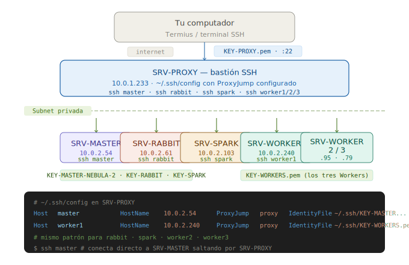
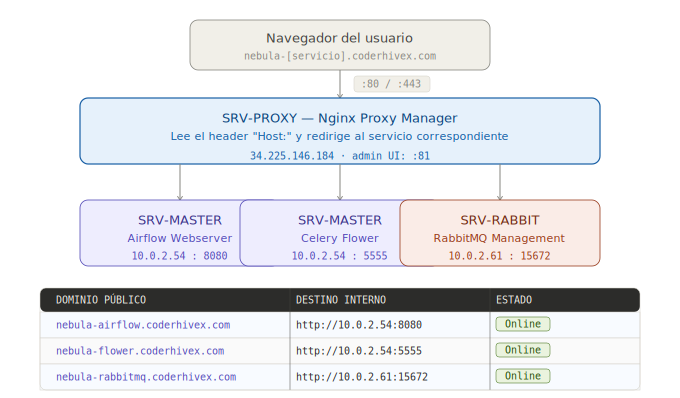
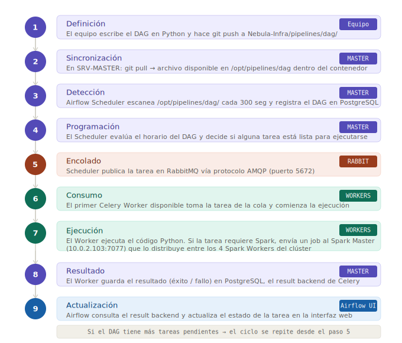

# DOC 3 — Configuración Operativa y Flujo

> **Proyecto:** NEBULA  
> **Herramienta de acceso SSH:** Termius  
> **Repositorio:** [Nebula-Infra](https://github.com/HecRodCode/Nebula-Infra)

---

## Tabla de Contenidos

1. [Acceso SSH con Termius](#1-acceso-ssh-con-termius)
   - [¿Qué es Termius?](#11-qué-es-termius)
   - [Lógica del bastión](#12-lógica-del-bastión)
   - [Paso a paso: configurar el acceso completo](#13-paso-a-paso-configurar-el-acceso-completo)
   - [Configuración del archivo `~/.ssh/config`](#14-configuración-del-archivo-sshconfig)
2. [Despliegue con Docker](#2-despliegue-con-docker)
   - [Instalación de Docker](#21-instalación-de-docker)
   - [Estructura de archivos por instancia](#22-estructura-de-archivos-por-instancia)
   - [Configuración del `.env`](#23-configuración-del-env)
   - [Orden de levantamiento de servicios](#24-orden-de-levantamiento-de-servicios)
3. [Nginx y Dominios](#3-nginx-y-dominios)
   - [¿Cómo funciona el enrutamiento?](#31-cómo-funciona-el-enrutamiento)
   - [Proxy hosts configurados](#32-proxy-hosts-configurados)
   - [Acceso a las interfaces](#33-acceso-a-las-interfaces)
4. [Flujo de un DAG](#4-flujo-de-un-dag)
   - [¿Qué es un DAG?](#41-qué-es-un-dag)
   - [Ciclo de vida completo](#42-ciclo-de-vida-completo)
   - [¿Qué pasa si un DAG falla?](#43-qué-pasa-si-un-dag-falla)
5. [Monitoreo del Sistema](#5-monitoreo-del-sistema)
   - [Airflow UI](#51-airflow-ui)
   - [Celery Flower](#52-celery-flower)
   - [RabbitMQ Management](#53-rabbitmq-management)
6. [Referencia Rápida de Comandos](#6-referencia-rápida-de-comandos)

---

## 1. Acceso SSH con Termius

### 1.1 ¿Qué es Termius?

Termius es un cliente SSH con interfaz gráfica que permite conectarse a servidores remotos de forma sencilla. En lugar de escribir comandos SSH largos cada vez, Termius guarda los datos de conexión (host, usuario, clave) y permite conectarse con un clic. También incluye un cliente **SFTP** para transferir archivos entre tu máquina local y los servidores.

En NEBULA usamos Termius para:
- Transferir los archivos `.pem` (claves SSH) desde la máquina local al servidor Proxy.
- Conectarnos a cualquier instancia del clúster a través del bastión.

---

### 1.2 Lógica del Bastión

Todos los servidores del clúster (excepto SRV-PROXY) viven en la **subnet privada** y no tienen IP pública. Esto significa que **no se puede acceder a ellos directamente desde internet**. Para conectarse a ellos, primero hay que pasar por SRV-PROXY, que actúa como puerta de entrada.

Este patrón se llama **Bastion Host** y funciona así:

```
Tu computador
     │
     │  SSH con KEY-PROXY.pem
     │  → IP pública: 34.225.146.184
     ▼
SRV-PROXY (bastión)
     │
     ├── ProxyJump → SRV-MASTER  (10.0.2.54)   KEY-MASTER-NEBULA-2.pem
     ├── ProxyJump → SRV-RABBIT  (10.0.2.61)   KEY-RABBIT.pem
     ├── ProxyJump → SRV-SPARK   (10.0.2.103)  KEY-SPARK.pem
     ├── ProxyJump → SRV-WORKER1 (10.0.2.240)  KEY-WORKERS.pem
     ├── ProxyJump → SRV-WORKER2 (10.0.2.95)   KEY-WORKERS.pem
     └── ProxyJump → SRV-WORKER3 (10.0.2.79)   KEY-WORKERS.pem
```

**ProxyJump** es una directiva SSH que le dice al cliente: *"Para llegar a este servidor, primero conéctate a este otro como intermediario"*. Toda la configuración de ProxyJump se define en el archivo `~/.ssh/config` dentro de SRV-PROXY.

<!-- DIAGRAMA: Flujo de acceso SSH con bastión -->


---

### 1.3 Paso a Paso: Configurar el Acceso Completo

#### Paso 1 — Transferir las claves `.pem` al Proxy via SFTP

Desde Termius, usar la función SFTP para mover los 5 archivos `.pem` desde tu máquina local a SRV-PROXY. Los archivos deben quedar inicialmente en el directorio home (`/home/ubuntu/`).

Los archivos a transferir son:
```
KEY-PROXY.pem
KEY-MASTER-NEBULA-2.pem
KEY-RABBIT.pem
KEY-WORKERS.pem
KEY-SPARK.pem
```

---

#### Paso 2 — Mover las claves a la carpeta `.ssh`

Conectarse a SRV-PROXY por SSH y ejecutar:

```bash
mv KEY-PROXY.pem ~/.ssh/
mv KEY-MASTER-NEBULA-2.pem ~/.ssh/
mv KEY-RABBIT.pem ~/.ssh/
mv KEY-WORKERS.pem ~/.ssh/
mv KEY-SPARK.pem ~/.ssh/
```

---

#### Paso 3 — Asignar permisos correctos a las claves

Las claves `.pem` deben tener permisos de solo lectura para el propietario. Si tienen permisos más amplios, SSH se negará a usarlas por seguridad.

```bash
chmod 400 ~/.ssh/KEY-PROXY.pem
chmod 400 ~/.ssh/KEY-MASTER-NEBULA-2.pem
chmod 400 ~/.ssh/KEY-RABBIT.pem
chmod 400 ~/.ssh/KEY-WORKERS.pem
chmod 400 ~/.ssh/KEY-SPARK.pem
```

> **¿Qué significa `chmod 400`?** Establece permisos de lectura solo para el propietario del archivo. SSH rechaza claves con permisos más amplios porque considera que están "expuestas".

---

#### Paso 4 — Activar el agente SSH y agregar las claves

El agente SSH es un proceso que guarda las claves en memoria para no tener que escribir contraseñas cada vez. Ejecutar primero:

```bash
eval "$(ssh-agent -s)"
```

Luego agregar cada clave al agente:

```bash
ssh-add ~/.ssh/KEY-PROXY.pem
ssh-add ~/.ssh/KEY-MASTER-NEBULA-2.pem
ssh-add ~/.ssh/KEY-RABBIT.pem
ssh-add ~/.ssh/KEY-WORKERS.pem
ssh-add ~/.ssh/KEY-SPARK.pem
```

---

#### Paso 5 — Configurar `~/.ssh/config`

Este es el paso más importante. El archivo `config` le dice a SSH cómo conectarse a cada servidor: qué IP usar, qué usuario, qué clave y por cuál bastión saltar.

```bash
nano ~/.ssh/config
```

---

### 1.4 Configuración del Archivo `~/.ssh/config`

Copiar exactamente el siguiente contenido en el archivo:

```
Host proxy
    HostName 34.225.146.184
    User ubuntu
    IdentityFile ~/.ssh/KEY-PROXY.pem

Host master
    HostName 10.0.2.54
    User ubuntu
    ProxyJump proxy
    IdentityFile ~/.ssh/KEY-MASTER-NEBULA-2.pem

Host rabbit
    HostName 10.0.2.61
    User ubuntu
    ProxyJump proxy
    IdentityFile ~/.ssh/KEY-RABBIT.pem

Host spark
    HostName 10.0.2.103
    User ubuntu
    ProxyJump proxy
    IdentityFile ~/.ssh/KEY-SPARK.pem

Host worker1 worker2 worker3
    ProxyJump proxy
    IdentityFile ~/.ssh/KEY-WORKERS.pem
    User ubuntu

Host worker1
    HostName 10.0.2.240

Host worker2
    HostName 10.0.2.95

Host worker3
    HostName 10.0.2.79
```

**¿Cómo leer esta configuración?**

Cada bloque `Host [nombre]` define un alias de conexión. Por ejemplo, con la configuración anterior, en lugar de escribir:

```bash
ssh -i ~/.ssh/KEY-MASTER-NEBULA-2.pem -J ubuntu@34.225.146.184 ubuntu@10.0.2.54
```

Simplemente se escribe:

```bash
ssh master
```

SSH lee el archivo `config`, ve que `master` tiene `ProxyJump proxy`, primero se conecta a `proxy` (SRV-PROXY) y desde allí salta a `10.0.2.54` usando la clave correcta. Todo esto ocurre de forma automática y transparente.

**Tabla de aliases disponibles después de la configuración:**

| Alias | Servidor | IP | Comando |
|---|---|---|---|
| `proxy` | SRV-PROXY | `34.225.146.184` | `ssh proxy` |
| `master` | SRV-MASTER | `10.0.2.54` | `ssh master` |
| `rabbit` | SRV-RABBIT | `10.0.2.61` | `ssh rabbit` |
| `spark` | SRV-SPARK | `10.0.2.103` | `ssh spark` |
| `worker1` | SRV-WORKER1 | `10.0.2.240` | `ssh worker1` |
| `worker2` | SRV-WORKER2 | `10.0.2.95` | `ssh worker2` |
| `worker3` | SRV-WORKER3 | `10.0.2.79` | `ssh worker3` |

> ⚠️ **Importante:** estos aliases solo funcionan si el comando se ejecuta **desde SRV-PROXY**, donde está el archivo `~/.ssh/config` configurado. No funcionan desde tu máquina local a menos que también configures el mismo archivo allí.

---

## 2. Despliegue con Docker

### 2.1 Instalación de Docker

Docker debe instalarse en **cada instancia** antes de levantar los servicios. Ejecutar los siguientes comandos en orden:

```bash
sudo apt-get update

sudo apt-get install -y ca-certificates curl gnupg

sudo install -m 0755 -d /etc/apt/keyrings

curl -fsSL https://download.docker.com/linux/ubuntu/gpg | sudo gpg --dearmor -o /etc/apt/keyrings/docker.gpg

sudo chmod a+r /etc/apt/keyrings/docker.gpg

echo \
  "deb [arch="$(dpkg --print-architecture)" signed-by=/etc/apt/keyrings/docker.gpg] https://download.docker.com/linux/ubuntu \
  "$(. /etc/os-release && echo "$VERSION_CODENAME")" stable" | \
  sudo tee /etc/apt/sources.list.d/docker.list > /dev/null

sudo apt-get update

sudo apt-get install -y docker-ce docker-ce-cli containerd.io docker-buildx-plugin docker-compose-plugin

sudo usermod -aG docker $USER

newgrp docker
```

> **¿Qué hacen estos comandos?** Agregan el repositorio oficial de Docker a Ubuntu, instalan Docker y Docker Compose, y agregan el usuario `ubuntu` al grupo `docker` para poder usar Docker sin `sudo`.

---

### 2.2 Estructura de Archivos por Instancia

Después de clonar el repositorio en cada instancia, la estructura relevante queda así:

```bash
# Clonar el repo (hacerlo en cada instancia)
git clone https://github.com/HecRodCode/Nebula-Infra.git
```

Cada instancia trabaja con su carpeta correspondiente dentro del repo:

| Instancia | Carpeta del repo | Archivo principal |
|---|---|---|
| SRV-PROXY | `Proxy-Nginx/` | `docker-compose.yml` |
| SRV-MASTER | `Master/` | `docker-compose.yml` + `.env` |
| SRV-RABBIT | `RabbitMQ/` | `docker-compose.yml` + `.env` |
| SRV-SPARK | `Spark/` | `docker-compose.yml` + `.env` |
| SRV-WORKER1/2/3 | `Workers/` | `docker-compose.yml` + `.env` |

> Los DAGs de Airflow se agregan en `pipelines/dag/`. Esta carpeta está montada como volumen en los contenedores de Airflow (Master y Workers), por lo que cualquier archivo `.py` que se agregue aquí será detectado automáticamente por el Scheduler.

---

### 2.3 Configuración del `.env`

El `.env` contiene todas las variables de entorno sensibles (contraseñas, IPs, tokens). **No está en el repositorio** y debe crearse manualmente en cada instancia dentro de su carpeta correspondiente.

El proceso es el mismo para todas las instancias:

```bash
ssh [alias]                        # Conectarse desde SRV-PROXY
cd Nebula-Infra/[Carpeta]/         # Navegar a la carpeta del servicio
nano .env                          # Crear y pegar el contenido del .env
```

| Instancia | Alias SSH | Carpeta |
|---|---|---|
| SRV-MASTER | `ssh master` | `Master/` |
| SRV-RABBIT | `ssh rabbit` | `RabbitMQ/` |
| SRV-SPARK | `ssh spark` | `Spark/` |
| SRV-WORKER1 | `ssh worker1` | `Workers/` |
| SRV-WORKER2 | `ssh worker2` | `Workers/` |
| SRV-WORKER3 | `ssh worker3` | `Workers/` |

> ⚠️ **En los Workers, cambiar `CELERY_HOSTNAME`** según la instancia (`worker1`, `worker2`, `worker3`). El resto del `.env` es idéntico. Ver **DOC4** para el detalle completo de variables.

---

### 2.4 Orden de Levantamiento de Servicios

Los servicios tienen dependencias entre sí. Levantarlos en el orden equivocado puede causar fallos al inicio. El orden correcto es:

```
① SRV-PROXY
② SRV-RABBIT
③ SRV-MASTER
④ SRV-SPARK
⑤ SRV-WORKER1 → SRV-WORKER2 → SRV-WORKER3
```

**¿Por qué este orden?**

- **PROXY primero:** no tiene dependencias. Puede estar listo desde el inicio.
- **RABBIT antes que MASTER y WORKERS:** tanto Airflow como los Workers intentan conectarse a RabbitMQ al iniciar. Si no está disponible, fallan.
- **MASTER antes que WORKERS:** los Workers necesitan conectarse a PostgreSQL (que vive en el Master) para el result backend.
- **SPARK antes que WORKERS:** los Spark Workers de SRV-WORKER1/2/3 intentan registrarse en el Spark Master al iniciar. Si no está disponible, el proceso Spark en los Workers falla.

**Comando para levantar en cada instancia:**

```bash
# Navegar a la carpeta correcta del repo y ejecutar:
docker compose up -d
```

El flag `-d` (detached) hace que los contenedores corran en segundo plano. La terminal queda libre para seguir trabajando.

**Verificar que los contenedores levantaron correctamente:**

```bash
docker ps
```

Este comando muestra todos los contenedores en ejecución con su estado, nombre y puertos. Si algún contenedor no aparece o muestra estado `Exited`, puede verse el error con:

```bash
docker logs [nombre_del_contenedor]
```

**Contenedores esperados por instancia:**

| Instancia | Contenedores esperados |
|---|---|
| SRV-PROXY | `app` (Nginx Proxy Manager) |
| SRV-MASTER | `postgres`, `airflow-init` (temporal), `airflow-webserver`, `airflow-scheduler`, `airflow-triggerer`, `flower` |
| SRV-RABBIT | `rabbitmq` |
| SRV-SPARK | `spark-master`, `spark-worker-1` |
| SRV-WORKER1/2/3 | `airflow-worker`, `spark-worker` |

> 💡 En SRV-MASTER el contenedor `airflow-init` solo corre al primer levantamiento para inicializar la base de datos y crear el usuario admin. En levantamientos posteriores aparece brevemente y luego termina con estado `Exited (0)`, lo cual es **normal y esperado**.

---

## 3. Nginx y Dominios

### 3.1 ¿Cómo Funciona el Enrutamiento?

Nginx Proxy Manager actúa como **reverse proxy**: recibe todas las peticiones HTTP/HTTPS que llegan a SRV-PROXY y las redirige internamente al servicio correcto según el dominio solicitado.

El flujo es el siguiente:

```
Usuario en su navegador
       │
       │  https://nebula-airflow.coderhivex.com
       ▼
SRV-PROXY (34.225.146.184) — puerto 80/443
       │
       │  Nginx lee el header "Host: nebula-airflow.coderhivex.com"
       │  y busca la regla de proxy correspondiente
       ▼
  Redirige internamente a → http://10.0.2.54:8080
       │
       ▼
  SRV-MASTER — Airflow Webserver responde
       │
       ▼
  SRV-PROXY devuelve la respuesta al usuario
```

Para el usuario, parece que está hablando directamente con Airflow. En realidad, todo pasa por el Proxy. Los servicios internos nunca quedan expuestos directamente a internet.




---

### 3.2 Proxy Hosts Configurados

La interfaz de administración de Nginx Proxy Manager está en `http://34.225.146.184:81`. Los tres proxy hosts configurados son:

| Dominio (fuente) | Destino interno | Puerto interno | SSL | Estado |
|---|---|---|---|---|
| `nebula-airflow.coderhivex.com` | `10.0.2.54` | `8080` | HTTP Only | 🟢 Online |
| `nebula-flower.coderhivex.com` | `10.0.2.54` | `5555` | HTTP Only | 🟢 Online |
| `nebula-rabbitmq.coderhivex.com` | `10.0.2.61` | `15672` | HTTP Only | 🟢 Online |

> **Nota sobre SSL:** Los tres proxies están actualmente en modo "HTTP Only". El tráfico entre el usuario y el proxy **no está encriptado**. Para un ambiente de producción, se debería activar SSL con Let's Encrypt directamente desde la interfaz de Nginx Proxy Manager.

---

### 3.3 Acceso a las Interfaces

| Interfaz | URL | Credenciales | Descripción |
|---|---|---|---|
| Airflow UI | `http://nebula-airflow.coderhivex.com` | `admin / admin` | DAGs, ejecuciones, logs, conexiones |
| Celery Flower | `http://nebula-flower.coderhivex.com` | — | Estado de Workers en tiempo real |
| RabbitMQ Management | `http://nebula-rabbitmq.coderhivex.com` | `admin / admin123` | Colas, mensajes pendientes, consumers |

> El detalle de cómo usar cada interfaz está en la **Sección 5 — Monitoreo del Sistema**.

---

## 4. Flujo de un DAG

### 4.1 ¿Qué es un DAG?

Un **DAG** (Directed Acyclic Graph — Grafo Acíclico Dirigido) es la forma en que Airflow define un pipeline de datos. Es un archivo Python (`.py`) que describe:
- Qué tareas hay que ejecutar.
- En qué orden deben ejecutarse (cuáles dependen de cuáles).
- Cuándo deben ejecutarse (horario, frecuencia).
- Qué hacer si una tarea falla.

El nombre "acíclico" significa que el flujo de las tareas nunca forma un ciclo: cada tarea avanza hacia adelante, nunca vuelve atrás.

**Ejemplo visual de un DAG simple:**
```
[extraer_datos] → [transformar_datos] → [cargar_en_bd] → [enviar_reporte]
```

Los DAGs se guardan en la carpeta `pipelines/dag/` del repositorio y son detectados automáticamente por Airflow.

---

### 4.2 Ciclo de Vida Completo

Este es el recorrido completo que hace una tarea desde que se define hasta que se completa:

```
① DEFINICIÓN
   El equipo escribe el DAG en Python y lo sube a pipelines/dag/
   El archivo queda disponible en el volumen montado en /opt/pipelines/dag

② DETECCIÓN
   [SRV-MASTER — Airflow Scheduler]
   El Scheduler monitorea /opt/pipelines/dag/ cada N segundos
   Cuando detecta un nuevo DAG o uno modificado, lo registra en la BD

③ PROGRAMACIÓN
   [SRV-MASTER — Airflow Scheduler]
   El Scheduler evalúa si alguna tarea está lista para ejecutarse
   (según el horario definido en el DAG o si fue disparada manualmente)

④ ENCOLADO
   [SRV-MASTER → SRV-RABBIT]
   El Scheduler serializa la tarea y la publica en RabbitMQ
   La tarea queda en la cola esperando ser tomada por un Worker
   Puerto usado: 5672 (AMQP)

⑤ CONSUMO
   [SRV-RABBIT → SRV-WORKER1/2/3]
   El primer Celery Worker disponible toma la tarea de la cola
   El Worker la deserializa y comienza su ejecución

⑥ EJECUCIÓN
   [SRV-WORKER1/2/3]
   El Worker ejecuta el código Python de la tarea
   Si la tarea requiere procesamiento masivo de datos,
   envía un job a SRV-SPARK que lo distribuye entre los Spark Workers

⑦ RESULTADO
   [SRV-WORKER1/2/3 → SRV-MASTER]
   Al terminar, el Worker guarda el resultado (éxito o fallo)
   en PostgreSQL a través del result backend
   Puerto usado: 5432

⑧ ACTUALIZACIÓN
   [SRV-MASTER — Airflow]
   Airflow consulta el result backend y actualiza el estado de la tarea
   El estado queda visible en la UI (verde = éxito, rojo = fallo)

⑨ SIGUIENTE TAREA
   Si el DAG tiene más tareas, el Scheduler repite el proceso
   desde el paso ④ con la siguiente tarea en el flujo
```




---

### 4.3 ¿Qué Pasa si un DAG Falla?

Airflow tiene mecanismos de manejo de fallos que se configuran dentro del propio DAG:

**Reintentos automáticos:** Se puede configurar cuántas veces Airflow debe reintentar una tarea fallida antes de marcarla como error definitivo:
```python
default_args = {
    'retries': 3,           # Intentar hasta 3 veces
    'retry_delay': timedelta(minutes=5)  # Esperar 5 min entre intentos
}
```

**Alertas:** Airflow puede enviar notificaciones por email cuando una tarea falla.

**Revisión manual:** Desde la UI de Airflow se puede ver exactamente en qué tarea falló el DAG, los logs completos del error, y se puede relanzar manualmente solo esa tarea (sin repetir todo el DAG desde el inicio).

---

## 5. Monitoreo del Sistema

Una vez levantado el clúster, estas son las herramientas para verificar que todo está funcionando correctamente.

---

### 5.1 Airflow UI

**URL:** `http://nebula-airflow.coderhivex.com`

**¿Cómo verificar que Airflow está funcionando?**

1. Abrir la URL. Debe cargar la pantalla de login.
2. Ingresar con `admin / admin`.
3. En el dashboard principal, verificar:
   - Los DAGs aparecen en la lista.
   - El ícono de estado del Scheduler (esquina inferior izquierda) está en verde.
   - No hay alertas de error en la barra superior.

**Vistas más útiles:**

| Vista | ¿Para qué sirve? |
|---|---|
| DAGs (principal) | Ver todos los DAGs, sus estados y próximas ejecuciones |
| Grid View | Ver el historial de ejecuciones de un DAG en formato grilla |
| Graph View | Ver el flujo de tareas de un DAG como diagrama |
| Logs | Ver los logs detallados de cada tarea ejecutada |
| Admin → Connections | Gestionar conexiones a bases de datos, S3, APIs, etc. |

---

### 5.2 Celery Flower

**URL:** `http://nebula-flower.coderhivex.com`

**¿Cómo verificar que los Workers están funcionando?**

1. Abrir la URL. El dashboard debe cargar inmediatamente.
2. En la pestaña **Workers**, verificar que aparecen los 3 Workers:
   - `worker1@10.0.2.240`
   - `worker2@10.0.2.95`
   - `worker3@10.0.2.79`
3. El estado de cada Worker debe ser **Online** (punto verde).

Si algún Worker no aparece o está **Offline**, puede ser porque:
- El contenedor `airflow-worker` en esa instancia no levantó. Verificar con `docker ps` en esa instancia.
- RabbitMQ no estaba disponible cuando el Worker intentó conectarse. Reiniciar el contenedor con `docker compose restart airflow-worker`.

**Pestañas útiles en Flower:**

| Pestaña | ¿Para qué sirve? |
|---|---|
| Dashboard | Vista general: tareas activas, procesadas, fallidas |
| Workers | Estado de cada Worker, tareas que están ejecutando |
| Tasks | Historial de tareas con tiempo de ejecución y estado |
| Broker | Información sobre las colas de RabbitMQ |

---

### 5.3 RabbitMQ Management

**URL:** `http://nebula-rabbitmq.coderhivex.com`

**¿Cómo verificar que RabbitMQ está funcionando?**

1. Abrir la URL. Debe cargar la interfaz de administración.
2. Ingresar con `admin / admin123`.
3. En la pestaña **Overview**, verificar:
   - El servidor muestra estado **Running**.
   - No hay colas con mensajes acumulados en exceso (podría indicar que los Workers no están consumiendo).
4. En la pestaña **Connections**, verificar que hay conexiones activas de los Workers.

**¿Qué significa ver mensajes acumulados en la cola?**

Si la cola tiene muchos mensajes sin consumir, puede indicar:
- Los Workers están caídos o sobrecargados.
- Se dispararon demasiados DAGs simultáneamente y los Workers no dan abasto.
- Hay un error en los Workers que les impide procesar las tareas.

---

## 6. Referencia Rápida de Comandos

### Comandos Docker

| Acción | Comando |
|---|---|
| Levantar todos los contenedores en segundo plano | `docker compose up -d` |
| Bajar todos los contenedores | `docker compose down` |
| Reiniciar un contenedor específico | `docker compose restart [nombre]` |
| Ver contenedores en ejecución | `docker ps` |
| Ver logs de un contenedor | `docker logs [nombre]` |
| Ver logs en tiempo real | `docker logs -f [nombre]` |
| Ver logs de los últimos N registros | `docker logs --tail 100 [nombre]` |
| Entrar al shell de un contenedor | `docker exec -it [nombre] bash` |

---

### Comandos de Archivos

| Acción | Comando |
|---|---|
| Ver todos los archivos (incluidos ocultos) | `ls -a` |
| Crear o editar un archivo | `nano [nombre_archivo]` |
| Eliminar un archivo | `rm [nombre_archivo]` |
| Ver contenido de un archivo | `cat [nombre_archivo]` |

---

### Comandos Git

| Acción | Comando |
|---|---|
| Clonar el repositorio | `git clone https://github.com/HecRodCode/Nebula-Infra.git` |
| Actualizar el repo con los últimos cambios | `git pull` |
| Ver estado de cambios locales | `git status` |

---

### Flujo de actualización de un DAG

Cuando se modifica o agrega un DAG, el flujo correcto es:

```
1. Editar/crear el archivo .py en pipelines/dag/ (en tu máquina local o en el servidor)
2. Hacer commit y push al repositorio en GitHub
3. En SRV-MASTER, ejecutar: git pull
4. El Scheduler de Airflow detecta el cambio automáticamente (cada 300 segundos según REFRESH_INTERVAL)
5. El nuevo DAG aparece en la UI de Airflow
```

> 💡 También es posible editar el archivo directamente en el servidor con `nano` y el cambio se refleja sin necesidad de `git pull`, ya que la carpeta `pipelines/dag/` está montada como volumen. Sin embargo, la buena práctica es siempre mantener el repositorio como fuente de verdad.

---

### Accesos rápidos

| Servicio | URL | Usuario | Contraseña |
|---|---|---|---|
| Airflow UI | `http://nebula-airflow.coderhivex.com` | `admin` | `admin` |
| Celery Flower | `http://nebula-flower.coderhivex.com` | — | — |
| RabbitMQ UI | `http://nebula-rabbitmq.coderhivex.com` | `admin` | `admin123` |
| Nginx Proxy Manager | `http://34.225.146.184:81` | (configurado al instalar NPM) | — |

---

*Este documento es parte de la documentación oficial del proyecto NEBULA. Para el contexto general y glosario de conceptos, ver **DOC1 — Contexto General**. Para la infraestructura detallada de AWS, ver **DOC2 — Infraestructura AWS**. Para la guía de variables de entorno, ver **DOC4 — Guía de Variables de Entorno**.*
